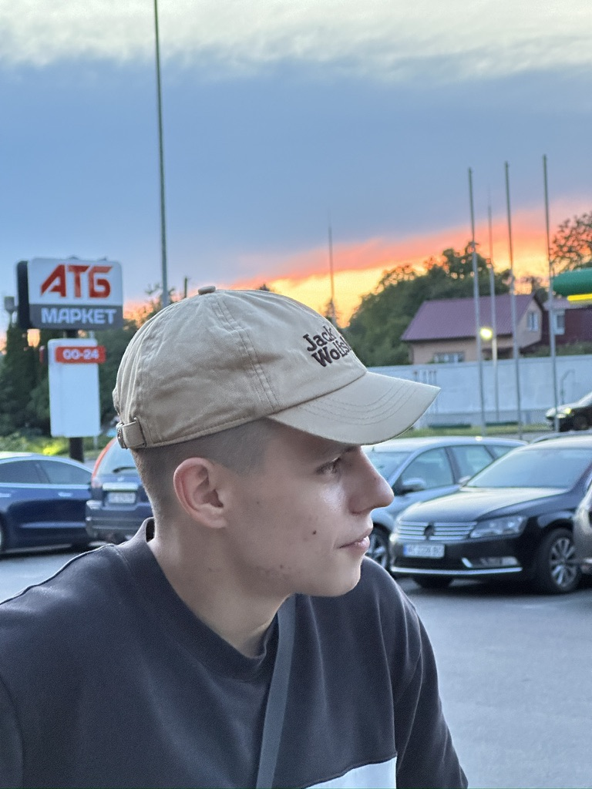

# Illia Bilous - DevOps Engineer Portfolio



## Project Overview

This project is a professional portfolio website for Illia Bilous, a DevOps Engineer. The website showcases skills, projects, experience, and provides a way for potential employers or clients to get in contact.

The portfolio features a modern, responsive design with both light and dark themes, interactive elements, and accessibility features to ensure a great user experience for all visitors.

## Technologies Used

### Frontend
- HTML5
- CSS3 (with custom properties for theming)
- JavaScript (ES6+)
- jQuery for DOM manipulation and animations
- Bootstrap 5 for responsive layout and components
- Particles.js for interactive background effects

### Icons and Fonts
- Bootstrap Icons
- Devicon for technology logos
- Google Fonts (via CDN)

### Features
- Responsive design for all device sizes
- Light/Dark theme toggle with system preference detection
- Interactive skill bars with animations
- Filterable skills and projects sections
- Contact form with validation and Telegram bot integration
- Smooth scrolling and navigation
- Animated section transitions
- Accessibility features for keyboard navigation and screen readers

## Project Structure

```
/
├── assets/                  # Static assets
│   ├── js/                  # Third-party JavaScript libraries
│   │   ├── particles.json   # Particles.js configuration
│   │   └── particles.min.js # Particles.js library
│   ├── logos/               # SVG logos for skills
│   ├── profile.jpg          # Profile image
│   └── resume.pdf           # Downloadable resume
├── css/
│   └── styles.css           # Main stylesheet with theme variables
├── js/
│   └── scripts.js           # Custom JavaScript functionality
├── index.html               # Main HTML file
├── style-guide.md           # Documentation of styles and components
└── README.md                # Project documentation
```

## Key Features

### Responsive Design
- Mobile-first approach
- Optimized for phones, tablets, and desktops
- Collapsible navigation on smaller screens
- Adjusted typography and spacing for different screen sizes

### Theme System
- Light and dark themes with smooth transitions
- System preference detection
- Persistent theme selection with localStorage
- WCAG AA compliant color contrast in both themes

### Skills Section
- Categorized skills with filterable tabs
- Animated progress bars
- Interactive hover effects
- Skill level indicators with tooltips

### Projects Section
- Filterable project cards
- Modal windows with detailed project information
- Links to GitHub repositories
- Technologies used badges

### Contact Form
- Client-side validation
- Animated feedback for user interactions
- Success and error states
- Integration with Telegram bot for message delivery

### Animations and Interactions
- Section entrance animations using Intersection Observer
- Micro-interactions for buttons, links, and cards
- Progress bar animations
- Smooth scrolling navigation

## Telegram Bot Integration

The contact form is integrated with a Telegram bot to deliver messages directly to the portfolio owner. When a visitor submits the contact form, the data is sent to a Telegram bot, which forwards it to the specified chat.

### Setup Instructions

1. Create a Telegram bot using [BotFather](https://t.me/botfather)
2. Get your bot token from BotFather
3. Get your chat ID (you can use the [userinfobot](https://t.me/userinfobot))
4. Replace the placeholder values in the `sendToTelegramBot` function in `js/scripts.js`:

```javascript
// Replace with your actual bot token and chat ID
const botToken = 'YOUR_TELEGRAM_BOT_TOKEN';
const chatId = 'YOUR_CHAT_ID';
```

## Accessibility Features

- Semantic HTML structure
- ARIA roles and labels for interactive elements
- Skip to content link for keyboard navigation
- Focus states for all interactive elements
- Color contrast meeting WCAG AA standards
- Keyboard navigable components
- Screen reader announcements for dynamic content
- Support for reduced motion preferences

## Browser Compatibility

The website is compatible with:
- Chrome (latest)
- Firefox (latest)
- Safari (latest)
- Edge (latest)
- Mobile browsers (iOS Safari, Android Chrome)

## Performance Optimizations

- Optimized images
- Minified third-party libraries
- Responsive loading of particles based on device capability
- Efficient animations using CSS transitions and transforms
- Lazy loading of modal content

## Setup and Local Development

1. Clone the repository
2. Open `index.html` in your browser to view the site
3. No build process or server is required for basic viewing
4. To enable the contact form functionality, update the Telegram bot credentials as described above

## Credits and Acknowledgments

- [Bootstrap](https://getbootstrap.com/) for the responsive grid and components
- [Particles.js](https://vincentgarreau.com/particles.js/) for the interactive background
- [jQuery](https://jquery.com/) for DOM manipulation
- [Devicon](https://devicon.dev/) for technology icons
- [Bootstrap Icons](https://icons.getbootstrap.com/) for UI icons

## License

This project is available for personal and commercial use with attribution.

## Contact

For any questions or inquiries, please use the contact form on the website or reach out directly via email.